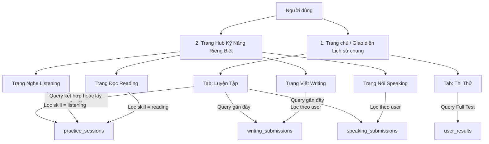

# Hướng Dẫn Thiết Kế & Triển Khai Chức Năng Lịch Sử Học Tập (TOEIC)
*(Tài liệu chuẩn hóa kiến trúc cơ sở dữ liệu và ánh xạ giao diện dành cho nhóm phát triển)*

Tài liệu này tổng hợp chi tiết các bảng (collections) cần dùng từ file [TOEIC_Firebase_Database_Complete.md](file:///d:/Toeic/Toeic_Backend/Docs/DatabaseDesign/TOEIC_Firebase_Database_Complete.md) để xây dựng trọn vẹn chức năng **Lịch sử luyện tập & Thi thử**. Giao diện lịch sử được chia làm 2 tầng trải nghiệm: **Lịch sử riêng lẻ tại từng trang kỹ năng** và **Lịch sử tổng hợp tại Trang chủ**.

---

## 🗺️ Sơ Đồ Ánh Xạ Giao Diện Lịch Sử & Cơ Sở Dữ Liệu (UI to DB Map)



---

## 📱 1. Thiết Kế Giao Diện & Cách Lấy Dữ Liệu (Query) Cho Từng Trang

### 📍 Trang Kỹ Năng Riêng Biệt (Skill-Specific Hub Screens)
Mỗi màn hình kỹ năng (Nghe, Nói, Đọc, Viết) sẽ có một danh sách **"Lịch sử luyện tập"** riêng biệt đặt ở dưới cùng để người dùng ôn tập nhanh.

#### A. Trang Viết (Writing Hub Screen):
* **Giao diện hiển thị:** Danh sách bài viết của riêng kỹ năng viết (ví dụ: *Phần 2 - Phản hồi yêu cầu | 4/5 câu | 15/04/2026*).
* **Bảng dữ liệu tương tác:** **`writing_submissions`**
* **Câu lệnh truy vấn (Query):**
  ```javascript
  firestore.collection("writing_submissions")
    .where("user_id", "==", current_uid)
    .orderBy("submitted_at", "desc")
  ```

#### B. Trang Nói (Speaking Hub Screen):
* **Giao diện hiển thị:** Danh sách bài nói, điểm số và audio ghi âm của user.
* **Bảng dữ liệu tương tác:** **`speaking_submissions`**
* **Câu lệnh truy vấn (Query):**
  ```javascript
  firestore.collection("speaking_submissions")
    .where("user_id", "==", current_uid)
    .orderBy("submitted_at", "desc")
  ```

#### C. Trang Nghe (Listening Hub) & Trang Đọc (Reading Hub):
* **Giao diện hiển thị:** Danh sách các lượt luyện tập trắc nghiệm lẻ theo Part (ví dụ: *Part 1 - Mô tả tranh | 8/10 câu | 16/04/2026*).
* **Bảng dữ liệu tương tác:** **`practice_sessions`**
* **Câu lệnh truy vấn (Query):**
  ```javascript
  // Lấy lịch sử cho trang Nghe (Listening)
  firestore.collection("practice_sessions")
    .where("user_id", "==", current_uid)
    .where("skill", "==", "listening")
    .orderBy("completed_at", "desc")

  // Lấy lịch sử cho trang Đọc (Reading)
  firestore.collection("practice_sessions")
    .where("user_id", "==", current_uid)
    .where("skill", "==", "reading")
    .orderBy("completed_at", "desc")
  ```

---

### 🏠 2. Trang Chủ / Trang Lịch Sử Tổng Hợp (Global History Screen)
Giao diện lịch sử tổng hợp tại Trang chủ chia làm 2 Tab rõ rệt:

#### 📊 Tab "Luyện tập" (Practice Hub History):
* **Giao diện hiển thị:** Dòng thời gian tổng hợp tất cả các lượt làm bài trắc nghiệm lẻ, luyện nói, luyện viết gần đây của người dùng.
* **Bảng dữ liệu tương tác:** Kết hợp (merge) dữ liệu gần đây từ `practice_sessions`, `writing_submissions` và `speaking_submissions`.
* **Cách hiển thị:** Gom chung danh sách, sắp xếp theo thời gian mới nhất lên trên.

#### 🏆 Tab "Thi" (Exam / Test History):
* **Giao diện hiển thị:** Kết quả các lần làm **Full Test 200 câu** để người dùng theo dõi biểu đồ tăng giảm điểm số TOEIC tổng thể.
* **Bảng dữ liệu tương tác:** **`user_results`**
* **Câu lệnh truy vấn (Query):**
  ```javascript
  firestore.collection("user_results")
    .where("user_id", "==", current_uid)
    .orderBy("completed_at", "desc")
  ```

---

## 💡 ĐẶC BIỆT LƯU Ý 1: Tại Sao Nghe & Đọc Dùng Chung Bảng `practice_sessions`?

> [!NOTE]
> Mặc dù giao diện hiển thị ở 2 màn hình hoàn toàn riêng biệt, nhưng kỹ năng **Nghe (Listening)** và **Đọc (Reading)** trắc nghiệm lẻ được thiết kế dùng chung collection `practice_sessions`.

### Lý do tối ưu hóa kỹ thuật:
1. **Tránh lặp code (DRY - Don't Repeat Yourself):** Cả Nghe và Đọc đều có chung cấu trúc lưu trữ (trắc nghiệm, số câu đúng/sai, thời gian, danh sách đáp án chọn). Việc dùng chung giúp giảm 50% lượng code phải viết ở Backend lẫn Frontend.
2. **Dễ bảo trì:** Khi muốn thêm tính năng mới (như tạm dừng làm bài, chấm điểm chi tiết theo chủ đề), ta chỉ cần sửa đúng 1 bảng thay vì đi sửa cả 2 bảng.
3. **Thống kê Trang chủ cực kỳ nhanh:** Khi cần vẽ biểu đồ tổng hợp hoặc hiển thị lịch sử ở Trang chủ, ta chỉ cần gọi 1 API từ bảng `practice_sessions` là có ngay toàn bộ lịch sử trắc nghiệm L&R thay vì phải query từ 2 bảng khác nhau rồi trộn (merge) thủ công rất chậm.
4. **Phân biệt dễ dàng:** Phân biệt cực kỳ đơn giản bằng trường `"skill": "listening"` hoặc `"skill": "reading"` và lọc trên giao diện.

---

## 💡 ĐẶC BIỆT LƯU Ý 2: Luồng Xử Lý Khi Luyện Tập Nhiều Câu Cùng Lúc (Gom Nhóm Phiên Làm Bài)

> [!IMPORTANT]
> **Vấn đề đặt ra:** Khi người dùng chọn luyện tập **10 câu** Part 1 Nghe hoặc **2 câu** viết luận cùng lúc, nếu mỗi câu lưu thành 1 dòng trong lịch sử thì danh sách lịch sử sẽ bị ngập lụt (spam) và cực kỳ rác.
>
> **Giải pháp tối ưu:** Toàn bộ lượt làm bài đó được xem là **1 phiên duy nhất (1 Session)**.

### Luồng Dữ Liệu (Data Flow) Hoạt Động Như Sau:

```
[User chọn luyện 10 câu] ──> [Làm bài xong & Bấm nộp] ──> [Tạo đúng 1 Document trong practice_sessions]
                                                                     │
[Bấm xem chi tiết câu sai] <── [Chỉ hiển thị 1 dòng lịch sử tổng quát] <─────┘
```

#### Bước 1: Lưu vào Database (1 Session duy nhất)
Dù làm 10 câu trắc nghiệm hay 2 bài viết luận trong cùng một lượt, hệ thống chỉ tạo **đúng 1 Document** trong database:
* Bảng `practice_sessions` (cho trắc nghiệm Nghe/Đọc) sẽ lưu:
  * Mảng `question_ids` chứa danh sách ID của cả 10 câu hỏi: `["q_01", "q_02", ..., "q_10"]`.
  * Map `answers` chứa đáp án user chọn tương ứng cho 10 câu: `{"q_01": "A", "q_02": "B", ...}`.
* Bảng `writing_submissions` hoặc `writing_results` tương tự nếu chọn làm nhiều câu luận cùng lúc.

#### Bước 2: Hiển thị trên màn hình Lịch sử (1 dòng duy nhất)
Giao diện lịch sử luyện tập chỉ hiển thị **đúng 1 dòng tổng quát**:
* 👉 *Luyện tập Part 1 - Mô tả tranh | Đúng: 8/10 câu | Ngày: 24/05/2026*

#### Bước 3: Xem lại bài làm (Result Review Screen)
Khi người dùng bấm chọn dòng lịch sử này:
1. **Frontend** đọc mảng `question_ids` từ Document đó để biết phiên này gồm 10 câu nào, sau đó load nội dung đề của cả 10 câu hỏi đó.
2. **Frontend** lấy dữ liệu từ `answers` của Document đó để tô màu hiển thị xem câu nào user làm đúng (màu xanh), câu nào làm sai (màu đỏ) và câu trả lời thực tế của user là gì.
3. Người dùng sẽ dùng cử chỉ **vuốt qua lại (Swipe / PageView)** để xem chi tiết từng câu trong 10 câu đó cực kỳ mượt mà trên cùng 1 trang review.

---

## 🗃️ Cấu Trúc Chi Tiết Các Collection Firestore (Schema Mẫu)

### Bảng 1: `practice_sessions` (Luyện trắc nghiệm Nghe & Đọc lẻ)
```json
{
  "id": "practice_session_001",
  "user_id": "uid_firebase_abc123",
  "session_type": "part_focus", // "practice" | "quick_review" | "part_focus"
  "skill": "listening", // "listening" | "reading" | "all"
  "parts_selected": [1], 
  "question_count": 10,
  "correct_count": 8,
  "incorrect_ids": ["q_part1_002", "q_part1_005"],
  "time_spent": 450, // giây
  "answers": {
    "q_part1_001": "A",
    "q_part1_002": "C"
  },
  "status": "completed",
  "started_at": "2026-05-24T15:00:00Z",
  "completed_at": "2026-05-24T15:07:30Z"
}
```

### Bảng 2: `user_results` (Thi thử Full Test L&R 200 câu)
```json
{
  "result_id": "result_exam_001",
  "user_id": "uid_firebase_abc123",
  "exam_id": "ets_2024_test_01",
  "score_listening": 380, // Điểm phần Nghe (5–495)
  "score_reading": 320, // Điểm phần Đọc (5–495)
  "total_score": 700, // Tổng điểm thi (10–990)
  "correct_count": 142,
  "time_spent": 7050, // giây
  "answers": {
    "q_001": "A",
    "q_200": "D"
  },
  "part_scores": {
    "part1": {"correct": 5, "total": 6},
    "part5": {"correct": 22, "total": 30}
  },
  "completed_at": "2026-05-24T16:00:00Z"
}
```

### Bảng 3: `writing_submissions` (Luyện tập & Thi Writing)
```json
{
  "id": "write_sub_001",
  "user_id": "uid_firebase_abc123",
  "question_id": "wrt_task8_002",
  "session_type": "practice", // "exam" | "practice"
  "user_answer": "I am writing this email to complain about...",
  "word_count": 125,
  "time_used": 600, // giây
  "ai_score": 4, // Điểm AI chấm
  "ai_feedback": {
    "grammar_score": 4,
    "vocabulary_score": 3,
    "cohesion_score": 4,
    "corrections_vi": "Sử dụng 'complain about' thay vì 'complain for'...",
    "suggested_improvement": "Bài viết trôi chảy nhưng cần đa dạng hóa từ vựng hơn."
  },
  "submitted_at": "2026-05-24T16:15:00Z"
}
```

### Bảng 4: `speaking_submissions` (Luyện tập & Thi Speaking)
```json
{
  "id": "speak_sub_001",
  "user_id": "uid_firebase_abc123",
  "question_id": "spk_task3_005",
  "session_type": "practice", // "exam" | "practice"
  "audio_url": "https://storage.googleapis.com/.../audio.wav", // Link file ghi âm
  "audio_duration": 45, // giây
  "transcript": "In this picture, I can see a group of people sitting around...",
  "ai_score": 3,
  "ai_feedback": {
    "pronunciation": 4,
    "grammar": 3,
    "vocabulary": 3,
    "feedback_vi": "Phát âm từ 'people' chưa chuẩn âm cuối, ngữ điệu tự nhiên."
  },
  "submitted_at": "2026-05-24T16:30:00Z"
}
```

---

## 👥 Hướng Dẫn Cộng Tác Nhóm Git

Để quá trình làm việc nhóm mượt mà, 4 bạn làm 4 kỹ năng hãy thống nhất quy trình sau:
1. **Frontend:** 
   * **Bạn làm Nghe/Đọc:** Thiết kế UI gọi API nộp bài lưu vào `practice_sessions` hoặc `user_results`.
   * **Bạn làm Viết/Nói:** Thiết kế UI nộp câu trả lời, gọi API gửi sang AI chấm điểm, sau đó gọi API lưu kết quả vào `writing_submissions`/`speaking_submissions`.
2. **Backend:** Tạo sẵn các Endpoint API tương ứng trên nhánh `develop` để 4 bạn Frontend kéo về dùng chung:
   * `POST /api/practice-sessions` (Lưu luyện tập trắc nghiệm)
   * `POST /api/user-results` (Lưu thi thử trắc nghiệm)
   * `POST /api/writing-submissions` (Lưu bài viết + AI chấm)
   * `POST /api/speaking-submissions` (Lưu bài nói + AI chấm)
